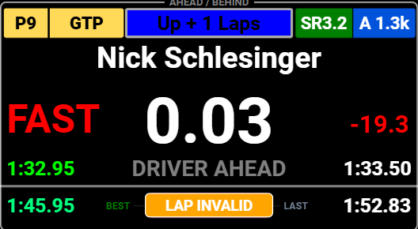
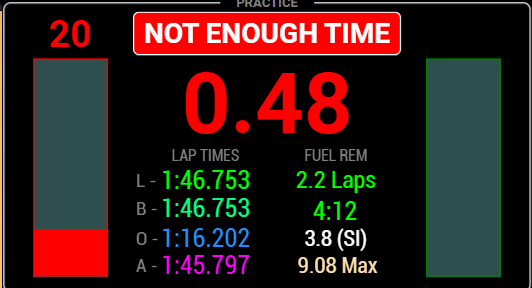
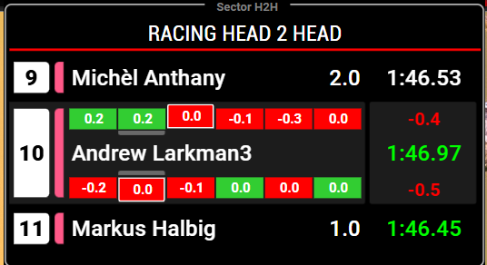
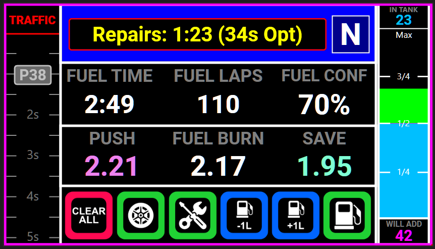
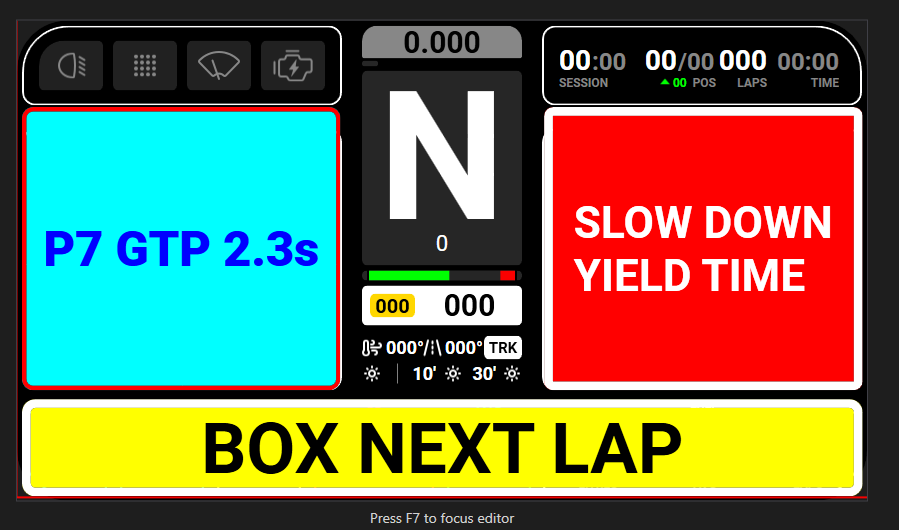

# Dashboards

> **Ownership reminder:** dashboards own presentation. Plugin/subsystems own logic, exports, and race calculations.

This page is the main driver-facing guide to the Lala dashboard package.

## 1. Overview

Lala dashboards exist to make the plugin's outputs readable while driving. They help you see race context, pit context, timing, alerts, and helper widgets in layouts that are practical to use in SimHub.

Keep the ownership split clear:

- **The plugin owns logic, telemetry interpretation, learning, persistence, and stable outputs.**
- **Dashboards own display, page layout, touch areas, and user interaction.**

That means dashboards are not the source of truth for strategy math, fuel learning, H2H selection, rejoin logic, or pit-entry calculations. They display the outputs the plugin publishes and let you interact with those surfaces in a driver-friendly way.

## Monitor System

The dashboard-facing Monitor System is enabled by default. Use **Dash Control -> Global Dash Functions -> General -> Enable Monitor System** to control it:

- enabled: `LalaLaunch.MonitorSystem.State` is `ON` and the default message is `MONITOR READY`;
- disabled: state is `OFF` and the message is `MONITOR OFF`;
- re-enabling returns the monitor to the ready state before later monitor messages are published.

The current monitor reports existing runtime fuel-health status, edge-triggered pit/fuel risk warnings, and small report-by-exception CarSA/Opponents/H2H impossible-state checks. It observes already-published subsystem outputs only; it does not send pit commands, select fallback targets, reset car/opponent/H2H state, or replace `Pit.Command.*` feedback.

Current driver-facing warning texts include `CHECK FUEL DATA`, `REFUEL OFF`, `MFD FUEL LOW`, `EXIT FUEL SHORT`, `BASELINE SHORT`, `OPPONENT DATA UNRELIABLE`, `TRAFFIC DATA UNRELIABLE`, and `H2H DATA UNRELIABLE`. Normal/clear messages remain `MONITOR READY`, `MONITOR OFF`, `FUEL HEALTH OK`, `FUEL DATA RECOVERED`, and `FUEL DATA FAULT`. Once the race is effectively ending, the monitor suppresses late `REFUEL OFF`, `MFD FUEL LOW`, and predictive `BASELINE SHORT` guidance noise while leaving `EXIT FUEL SHORT` and system-health/reliability warnings eligible.

## 2. Installation / import

At a high level, dashboard setup is:

1. Import the Lala dashboard files into SimHub.
2. Assign the imported dashboards to the screen or device you want to use.
3. Bind **Next Dash** and **Previous Dash** if you want reliable non-touch navigation.
4. Use **Dash Control** and your screen assignments to decide which surfaces you actually use while driving.

Dashboards can be assigned per device, and SimHub lets you combine touch navigation with button bindings. For the wider plugin setup flow, see [Quick Start](Quick_Start.md).

## 3. Navigation and bindings

The released dashboard package is built around simple page navigation plus temporary overlays.

### Main page navigation

On the Primary Driver Dash, the normal page flow is driven by:

- **left touch area** = previous page  
- **right touch area** = next page  
- SimHub **Previous Dash** binding  
- SimHub **Next Dash** binding  

You can use touch only, but physical bindings are strongly recommended for race use.

### Strategy Dash mode binding

The plugin exposes a **Strategy Dash Mode** binding in **Dash Control → Bindings**. Bind it to dashboard touch, a wheel button, or hardware control when you want the Strategy Dash to switch presentation between Advanced and Simple mode.

Dashboard status is plugin-owned:

- `LalaLaunch.StrategyDash.AdvancedMode` = `true` for Advanced, `false` for Simple.
- `LalaLaunch.StrategyDash.ModeText` = `ADVANCED` or `SIMPLE`.

Dashboards should use those exports only for presentation/visibility. Strategy math, fuel advice, and PreRace logic remain owned by the plugin.

### Strategy Dash fuel-burn analysis binding

A Strategy Dash fuel-burn popup or page can use the plugin-owned `LalaLaunch.Fuel.Burn.DisplayAnalysis` state. Toggle it with `LalaLaunch.BurnDisplayToggle`.

Optional reset actions are `LalaLaunch.BurnAnalysisResetAverages`, `LalaLaunch.BurnAnalysisResetCurrentStint`, `LalaLaunch.BurnAnalysisResetSessionAverage`, `LalaLaunch.BurnAnalysisResetMaxObserved`, and `LalaLaunch.BurnAnalysisResetMinObserved`; max/min observed resets are independent. Dashboards should consume `LalaLaunch.Fuel.Burn.Analysis.*` directly because the plugin owns accepted-lap filtering, Avg3/Avg5/Avg10 values, min/max observed values, and the conservative/optimistic `RemainingLapsMin` / `RemainingLapsMax` range. For readiness colouring, use `AvgSampleCount` for Avg3/Avg5/Avg10 (`>= 3` / `>= 5` / `>= 10` for full windows), `StintSampleCount` for `CurrentStint`, and `SessionSampleCount` for `SessionAvg`; the older `SampleCount` remains a session-count compatibility alias.

When manually editing dashboard formulas, use the single plugin-qualified property prefix only (for example `LalaLaunch.PreRace.StatusText`, not `LalaLaunch.LalaLaunch.PreRace.StatusText`).

### Binding scope in SimHub

Depending on how you organise your SimHub setup, those bindings can be configured:

- per dash,
- per device,
- or as broader/global bindings.

Use whichever approach best matches your hardware. The important point is that the Lala dashboards are designed to work with SimHub's standard next/previous dash navigation model.

### Auto-dash switching

If you use SimHub auto-dash switching, the active session type can determine which dashboard page becomes your landing page.

Practical expectations for the current Primary Dash package:

- qualifying sessions commonly land on the **Timing** page,
- practice sessions can use the **Practice** page when you select it manually,
- the race-oriented track/racing awareness pages are not the normal offline-testing surfaces when there are no opponents to reason about.

### Overlays are separate

Overlays are **temporary surfaces**, not part of the normal left/right page loop. They appear independently from normal page navigation when their conditions are active.

## 4. Current dashboard constraints (v1.x)

- Some dashboard behavior depends on optional SimHub-side configuration or optional exports; if those are not configured, related indicators may be missing.
- Wheelspin / traction-loss indications depend on optional ShakeIt Motors export setup (`TractionLoss` property).
- Primary Dash navigation behavior is still being refined and may evolve over upcoming releases.
- Dash Control bindings include **Strategy Dash Mode** for toggling the Strategy Dash between Advanced and Simple presentation. The dashboard-readable status is `LalaLaunch.StrategyDash.AdvancedMode` (`true` = Advanced, `false` = Simple), with `LalaLaunch.StrategyDash.ModeText` available for labels.

## 5. Primary Driver Dash

### Primary Dash overview

The Primary Driver Dash is the main race-driving surface. It is organised around a practical page order so you can move between awareness, standings, timing, practice, H2H context, and pit work without changing the underlying plugin behavior.

Current confirmed page order:

1. **Track Page (Nearby Ahead/Behind)**
2. **Racing Page (Class Standings Awareness)**
3. **Timing**
4. **Practice**
5. **Head-to-Head page**
6. **Pit Pop-Up**

*Primary Driver Dash track-awareness page.*

### Track Page (Nearby Ahead/Behind)

This is the nearby on-track awareness page.

Use it when you want a quick view of:

- the car ahead,
- the car behind,
- immediate on-track context,
- nearby race pressure while still staying focused on driving.

This page is about **local track situation**, not overall race-order classification. It is the "who is around me right now?" surface.

If you prefer a larger-focus view, the repo also includes a zoomed screenshot for this page:

*Zoomed Primary Dash view for nearby ahead/behind context.*

### Racing Page (Class Standings Awareness)

This page shifts from local track situation to **same-class race standings awareness**.

Use it when you want to understand:

- who is ahead of you in class standings,
- who is behind you in class standings,
- race-order context even when those cars are not currently on the same bit of track.

In practical terms:

- **Track Page** = nearby on-track context.  
- **Racing Page** = same-class opponents ahead/behind in standings regardless of lap position.

*Racing page focused on same-class standings awareness rather than immediate local track position.*

### Timing screen

The **Timing** page is the qualifying-focused timing surface.

Use it for timing-oriented checks such as:

- lap delta,
- personal best comparison,
- all-time best comparison,
- fuel remaining.

The central delta display can cycle between multiple timing modes:

- session personal best delta  
- estimated lap time  
- all-time best delta  

This can be changed using the **centre touch area** or the configured dash navigation binding.

This is the page you should expect to be most relevant in qualifying workflows, including when session-based auto-switching selects a more timing-oriented landing page.

**Screenshot placeholder:** no dedicated Timing-page screenshot is currently confirmed in the repo's Primary Dash image folder.

### Practice screen

The **Practice** page keeps the timing-style layout but adds more driver-input context.

Current confirmed use:

- timing-style information remains visible,
- throttle and brake inputs are included,
- ABS and TC alerts can be surfaced here,
- the page can be manually selected in practice sessions.

The throttle and brake bars allow you to see:

- brake application percentage,
- throttle application percentage,
- ABS activity,
- traction control / wheel spin alerts.

These alerts are designed primarily as **driver feedback during practice**, rather than race awareness.

Note: the **brake peak indicator** feature is currently temporarily disabled while undergoing an update.

*Practice page with timing-style context plus driver-input visibility.*

### Head-to-Head page

The **Head-to-Head** page gives you the same H2H view as the standalone H2H overlay, but inside the normal Primary Dash page flow.

Keep the role narrow:

- it is an additional way to view H2H context,
- it does not change H2H logic,
- it remains a display surface for plugin-owned H2H outputs.

For broader H2H concepts, also see [H2H System](H2H_System.md).

### Pit Pop-Up

The **Pit Pop-Up** is the pit-focused page in the Primary Dash flow.

It may appear **automatically when entering pit lane**, or it can be opened manually using the **Pit Screen binding**, depending on your workflow.

Current confirmed elements to expect here:

- traffic side bar,
- top alert area,
- fuel lines,
- pit controls,
- fuel gauge,
- pit box assist.

This is the main **pit work surface** for the Primary Dash package.

*Pit Pop-Up page with pit controls, fuel information, alert space, and pit-box support.*

### Overlay system / Lala Alerts

The Primary Dash package also uses a separate overlay layer. The main overlay host is **LalaAlerts**.

This is where temporary overlay messaging and widget-driven alerts live, including:

- side **spotter bars** that appear when a car is alongside,
- traffic alerts,
- penalty alerts,
- fuel alerts,
- radio-style messages,
- lap-invalid alerts,
- session-finished alerts,
- position-change alerts.

Think of LalaAlerts as a **temporary alert surface** that sits alongside the normal page flow rather than replacing it.

*LalaAlerts overlay showing the separate temporary alert layer used by the Primary Dash package.*

## 6. Shared widgets / overlays

These shared widgets belong to the dashboard package, but the plugin still owns the underlying calculations and activation rules.

### PitEntryAssist

PitEntryAssist is the focused pit-entry braking aid. It is there to help you judge the approach to pit speed and the entry line using plugin-owned pit-entry outputs.

See also [Pit Assist](Pit_Assist.md) for the wider pit-support explanation.

### PitPopUp

PitPopUp is the pit-focused temporary screen or page that brings pit controls, fuel lines, alert space, and pit-box support together when pit work becomes relevant.

### RejoinAssist

RejoinAssist is the recovery/rejoin warning surface. It helps you judge whether you are clear to rejoin, but it remains a presentation layer for plugin-owned rejoin and threat logic.

See [Rejoin Assist](Rejoin_Assist.md) for the full driver-facing system guide.

### LaunchAssist

LaunchAssist surfaces launch-related driver information on supported dashboards. It does not replace **Settings → Launch Settings** or **Launch Analysis**, and it does not become the owner of launch logic.

### StallWidget

StallWidget is a compact helper surface for stalling/restart awareness where the relevant dashboard layout includes it.

## 7. Remaining dashboard package sections

### Strategy Dash

Documentation pending.

### Head-to-Head overlay

Documentation pending.

## 8. Screenshot notes

The screenshots embedded above are limited to images that are already present in the repo under `Docs/Images/PrimaryDash/`.

Where a useful page-specific screenshot is not currently available in that folder, this guide uses a simple placeholder note rather than inventing a filename or implying an image exists when it does not.

## Pit Stop Debrief bindings

Dashboard layout files are not changed by the Pit Debrief V2 refinement. Dashboards consume plugin-owned outputs only and must not recompute service delta, box delta, loss delta, exit accuracy, or summary text. `SummaryText` can update before `Valid` becomes true, while existing overlays that key on `Valid`/`AgeSec` still show only finalized, latched summaries.

Alerts overlay contract:

- Visible when `LalaLaunch.Pit.Debrief.Valid == true` and `LalaLaunch.Pit.Debrief.AgeSec < 15`.
- Title: `PIT STOP DEBRIEF — STOP ` + `LalaLaunch.Pit.Debrief.StopIndex`.
- Body: `LalaLaunch.Pit.Debrief.SummaryText` (format `ENTRY ... (Δ ...) | BOX ... (Δ .../PENDING) | SVC ... | STRAT Δ ...`; exit prediction is available in debug fields/logs, not the summary). The entry headline is performance-oriented from line time loss, while limiter/safety quality remains in debug fields and can be `POOR` for a bad line-speed compliance verdict even when the headline remains `GOOD`. Box delta comes from `Pit.Box.LastDeltaSec` inverted to Pit Debrief sign (`actual elapsed - predicted target`; positive slower, negative faster) and is shown only when the plugin source is plausible, otherwise `Δ PENDING`.

Debug page fields:

- Entry: `LalaLaunch.Pit.Debrief.Entry.QualityText`, `LineTimeLossSec`, `DecelQualityText`, `LimiterQualityText`. Numeric `LineTimeLossSec` exports are raw doubles; debug dashboards should format them to two decimals when detailed review is needed.
- Box: `LalaLaunch.Pit.Debrief.Box.QualityText`, `MissedReason`, `StationarySec`.
- Service: `LalaLaunch.Pit.Debrief.Service.FuelAddedLitres`, `FuelTargetLitres`, `RefuelDurationSec`, `RefuelRateLps`, `TyreChangeCount`.
- Timing: `LalaLaunch.Pit.Debrief.Timing.PredictedTotalLossSec`, `ActualTotalLossSec`, `LossDeltaSec`, `LossSource`.
- Exit: `LalaLaunch.Pit.Debrief.Exit.PredictedPositionInClass`, `ActualPositionInClass`, `PositionDelta`, `AccuracyText`.

### 2026-06-08 Pit Debrief diagnostic note

Pit Debrief box/fuel source-trace diagnostics are SimHub log-only and do not require dashboard JSON/layout updates. Existing `Pit.Debrief.*` exports keep their names; `Pit.Box.LastDeltaSec` keeps its dashboard sign contract (`target - actual`, positive quicker/better). `Pit.Debrief.Service.FuelTargetLitres` remains debug/readout-only, preserves positive requested-add evidence through normal refuel completion/reset, and still clears explicit in-box refuel-cancel or true no-refuel/pre-flow cancel cases.
