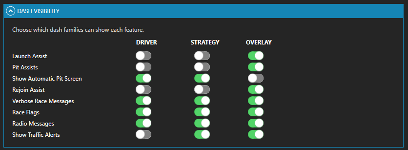

# Dashboards

This page explains the driver-facing dashboard layer for Lala Race Assist Plugin.

## 1. What dashboards are for

Dashboards are the display surface for the plugin. They help the driver see:

- strategy status,
- fuel confidence and pit context,
- H2H comparisons,
- rejoin and pit alerts,
- launch and Shift Assist cues,
- decluttered race information in the layout that suits the driver.

The dashboards are not the source of truth for learning, storage, strategy math, or saved decisions.

*Use the race dash for fast awareness while the plugin continues to own the calculations underneath.*

## 2. Typical dashboard roles

A common setup includes:

- a **primary race dash** for core race-critical data,
- a **strategy/support dash** for deeper planning context,
- an **overlay** for compact alerts,
- optional **Lovely-based layouts** when using that ecosystem.

*Keep deeper fuel and stint detail on a support surface instead of overloading the main race dash.*

## 3. What the driver controls

The main controls most users care about are:

- **Cancel Message**
- **Toggle Pit Screen**
- **Primary Dash Mode**
- **Declutter Mode**

These controls affect **presentation and visibility**. They do not change the ownership of the underlying plugin systems.

## 4. Dash Control philosophy

Dash Control is dash-oriented. Use it to manage:

- which surfaces are visible,
- how much information is shown,
- whether pit screens appear or are manually overridden,
- how the display behaves across different dashboard layouts.

In the Dash Visibility matrix, the short release-facing headers are:

- **DRIVER** = Lala Race Dash
- **STRATEGY** = Lala Strategy Dash
- **OVERLAY** = overlay surfaces

*Use Dash Control to decide what is shown where, not to change how the plugin calculates it.*

Do **not** use Dash Control as the mental home for strategy, launch logic, or saved profile learning.

## 5. Strategy, PreRace, and display boundaries

Dashboards can show:

- live strategy values,
- planner values,
- PreRace information.

Keep the roles straight:

- **Planner values** come from the Strategy workflow.
- **Live values** come from the runtime systems.
- **PreRace** is an on-grid/display layer only.

Seeing a value on a dash does not mean the dash owns that calculation.

## 6. Pit and rejoin screens

Pit and rejoin surfaces are some of the most practically useful dashboard pages.

- Pit screens may appear automatically when pit context becomes relevant.
- The driver can override with **Toggle Pit Screen**.
- Rejoin alerts support decision-making, but they do not replace driver judgment.
- If these surfaces are repeatedly wrong, the normal fix is profile or saved-data review rather than dash redesign.

*Pit entry cues are a good example of the dash presenting a live aid without becoming the owner of the underlying marker and timing logic.*

For the feature-specific guidance, see [Rejoin Assist](Rejoin_Assist.md) and [Pit Assist](Pit_Assist.md).

## 7. H2H on dashboards

Supported dashboards may show:

- **H2H Race** for same-class race-order comparisons
- **H2H Track** for same-class nearby on-track comparisons

The dash shows them; the plugin owns the comparison outputs. See [H2H System](H2H_System.md).

*H2H is there to improve race awareness on the dash, not to create a second planning workflow.*

### Tagged drivers and Friends list

If you want certain drivers to stand out more clearly, use **Settings → Friends List** in the plugin and add their iRacing customer IDs with the tag you want to apply.

For most users, the practical effect is on **awareness styling** in supported nearby-car / CarSA-style dashboard surfaces: tagged drivers can be easier to spot as **Friend**, **Teammate**, or **Bad**. Treat this as a presentation aid, not as something that changes strategy or core H2H ownership.

## 8. Practical layout advice

A simple setup usually works best:

- **Main dash:** race-critical information only
- **Support dash:** extra strategy and race-context detail
- **Overlay:** compact alerts and helper widgets

If a screen feels too busy, use **Primary Dash Mode**, **Declutter Mode**, and visibility choices before assuming a subsystem is wrong.
