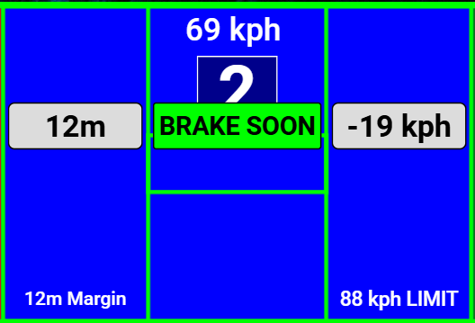

# Pit Assist

This page covers the driver-facing pit support in Lala Race Assist Plugin.

For a full post-install SimHub walkthrough of the plugin tabs and setup flow, see: [YouTube walkthrough (~30 min)](https://youtu.be/Ug9BRo0WRbE).

## 1. What Pit Assist includes

The pit-facing driver aids include:

- **pit popups** and pit-context screens,
- **Pit Entry Assist** braking guidance,
- profile-backed pit-loss and marker behavior that affects what the driver sees.

These systems are there to reduce avoidable mistakes under pressure. They do not remove the need for driver judgment.

## 2. Pit popups and pit screens

Pit popups are the driver-facing pit-context prompts shown on supported dashboards. They are useful for things like:

- pit screen context,
- pit-assist visibility,
- automatic pit-related prompts.

### What to trust

Trust pit popups most when your pit data is good. That usually means:

- pit-loss has been learned cleanly,
- pit markers are sensible,
- the track record has been validated and locked where appropriate.

### When to cancel or override

- Use **Toggle Pit Screen** if you want to force the pit screen on or off.
- Use **Cancel Message** if a popup needs to be dismissed right now.

### Pit command button mapping (Strategy Dash + PitPopUp)

Pit command buttons should now be bound to plugin-owned Controls & Events actions:

- `LalaLaunch.Pit.ClearAll`
- `LalaLaunch.Pit.ClearTires`
- `LalaLaunch.Pit.ToggleFuel`
- `LalaLaunch.Pit.FuelSetZero`
- `LalaLaunch.Pit.FuelAdd1`
- `LalaLaunch.Pit.FuelRemove1`
- `LalaLaunch.Pit.FuelAdd10`
- `LalaLaunch.Pit.FuelRemove10`
- `LalaLaunch.Pit.FuelSetMax`
- `LalaLaunch.Pit.ToggleTiresAll`
- `LalaLaunch.Pit.ToggleFastRepair`
- `LalaLaunch.Pit.ToggleAutoFuel`
- `LalaLaunch.Pit.Windshield`
- `LalaLaunch.Pit.FuelControl.SourceCycle`
- `LalaLaunch.Pit.FuelControl.ModeCycle`
- `LalaLaunch.Pit.FuelControl.SetPush`
- `LalaLaunch.Pit.FuelControl.SetNorm`
- `LalaLaunch.Pit.FuelControl.SetSave`

These actions replace any old dashboard bindings that directly called `IRacingExtraProperties` pit-command actions.

Pit Fuel Control behavior notes for these bindings:
- `LalaLaunch.Pit.FuelSetMax` is now a true transport toggle: press sequence alternates **MAX**, **ZERO**, **MAX**, **ZERO** ...
- Full-tank short-circuit only applies to the MAX phase; ZERO phase still sends (so a full tank does not block `#fuel 0.01`).
- `LalaLaunch.Pit.FuelControl.ModeCycle` enforces source re-selection guardrails:
  - cycling `MAN -> AUTO` while source is `PLAN` is allowed, but source is forced to `STBY` (user must pick a real source again),
  - cycling `MAN -> AUTO` while already on `STBY` keeps `STBY` and stays disarmed (`AutoArmed=false`) until a live source is selected and sent,
  - cycling `AUTO -> OFF` forces inert `OFF + STBY`.
- AUTO cancel/ownership rules:
  - AUTO cancels to `OFF + STBY` when live requested pit fuel moves outside the plugin’s own command suppression window,
  - AUTO cancels to `OFF + STBY` when iRacing AutoFuel is active,
  - Offline Testing suppresses Pit Fuel Control to inert `OFF + STBY`,
  - session-type changes and SessionState `1 -> 2` force reset to `OFF + STBY` (no reset on `2 -> 3`).

In Settings → **Pit Commands**, these are shown as fixed built-in features with normal binding rows (no raw chat command editing).

### Custom message buttons (Settings → Custom Messages)

Settings now also includes a **Custom Messages** expander with 10 custom slots.

Each slot has:
- a friendly label,
- message text content,
- its own bindable plugin action (`LalaLaunch.CustomMessage01` ... `LalaLaunch.CustomMessage10`).

Custom message slot edits are persisted in plugin settings immediately, so labels/message text survive SimHub restarts.

Use these for common race-chat messages you want on hardware buttons, keyboard keys, or dashboard virtual buttons, without exposing chat transport details in normal workflow.

### Runtime caveat

LalaLaunch injects iRacing pit/custom chat messages directly (no dedicated user macro-hotkey setup required).

If chat injection cannot run (for example iRacing is not the foreground window), LalaLaunch publishes `Pit Cmd Fail` and logs a pit-command warning so the failure is visible.

Settings includes a forward-looking **Auto-focus iRacing before pit/custom message send (Preview)** toggle for future enhancement work; current behavior still expects iRacing to already be in focus.

## 3. Pit Entry Assist

Pit Entry Assist helps you arrive at the pit entry line at the right speed. It uses saved marker context plus braking guidance to tell you whether you are:

- comfortably early,
- getting close,
- braking now,
- already late.

### What to trust

Trust Pit Entry Assist most when:

- the track markers are correct,
- the pit-entry settings fit the car,
- you have validated the system with at least one clean pit entry.

### When to override with judgment

Override it with your own judgment when:

- track conditions are unusual,
- traffic forces a compromised line,
- the saved settings are not yet validated for that car/track.

## 4. If pit behavior feels repeatedly wrong

If pit popups or Pit Entry Assist keep feeling wrong, review:

- saved pit markers,
- saved pit-loss data,
- pit entry deceleration settings,
- pit entry buffer settings,
- whether the current car/track data was learned cleanly.

## 5. Practical trust model

A good rule is:

- **Trust the system once the underlying data is good.**
- **Override it when the moment demands it.**
- **Relearn or review the saved data if it is repeatedly wrong.**
