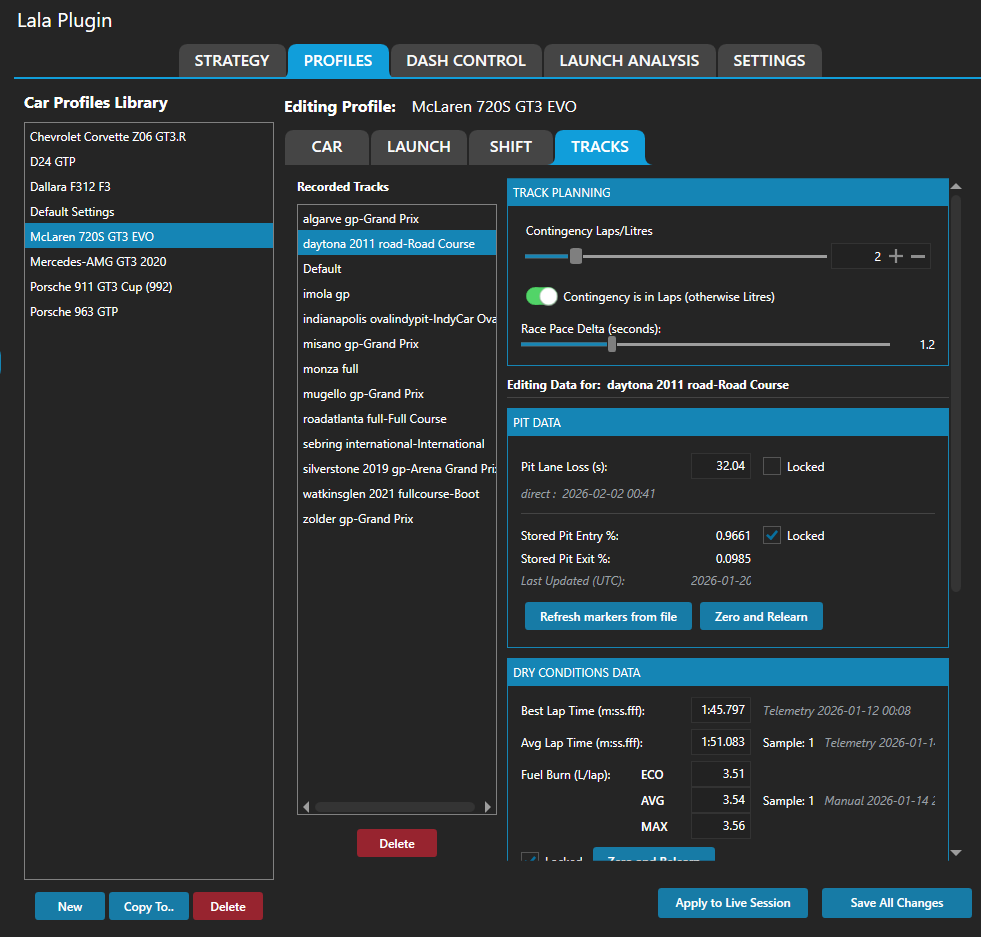

# Profiles System

This page explains the user-facing role of profiles in Lala Race Assist Plugin.

For a full post-install SimHub walkthrough of the plugin tabs and setup flow, see: [YouTube walkthrough (~30 min)](https://youtu.be/Ug9BRo0WRbE).

## 1. What profiles are for

Profiles are the plugin’s long-term memory. They let the plugin remember what it has learned about a car, a track, and the conditions you run in.

That matters because the driver experience should improve over time instead of starting from zero every session.

## 2. What profiles store in practical terms

Profiles help store or protect information such as:

- car-specific defaults,
- track and layout-specific learned values,
- dry vs wet condition differences,
- lock state for trusted values,
- relearn paths when something should be cleared and learned again.

In practical driver terms, that includes things like:

- strategy planning baselines,
- fuel and pace history,
- launch defaults,
- Shift Assist learning,
- pit-loss and marker data,
- pit-entry related tuning,
- other assist thresholds that should not reset every session.

## 3. Car, track, and condition storage

A useful way to think about profiles is:

- **car level:** defaults and system behavior that belong to the car
- **track/layout level:** learned venue-specific values
- **condition level:** separate trust for dry and wet running where needed

This stops one venue or one condition from poisoning another.

## 4. Locks, relearn, and trust

The normal lifecycle is:

**learn → validate → lock → trust**

### Lock

Lock values when they are representative and stable. Locking is how you tell the plugin, “this is good enough to trust.”

### Relearn

If something becomes unreliable, do not wipe everything by default. Relearn only the affected item or condition where possible, then let it stabilize again.

### Trust

Once good values are learned and locked, the driver should generally trust them rather than second-guessing them every session.

## 5. How profiles feed the other user systems

Profiles matter because they feed many user-facing systems:

- **Strategy** uses saved baseline values and track context
- **Fuel Model** benefits from trusted stored history
- **Shift Assist** relies on profile-backed learning and locks
- **Launch System** can start from stored defaults instead of guessing
- **Pit Assist** depends on trusted pit-loss, marker, and pit-entry-related data
- **Rejoin Assist** depends on profile-backed thresholds behaving sensibly

So even when the driver is not actively looking at the Profiles tab, profiles are still shaping the quality of the other systems.

## 6. Practical usage advice

- Treat the first clean sessions in a new combo as learning sessions.
- Lock only values that have settled and make sense.
- If one area looks wrong, review only that area before doing a broad reset.
- Keep dry and wet trust separate in your own thinking.
- Use profiles as the reason to trust the plugin more over time, not as a tab you visit only when something breaks.

## 7. When to review profiles

Review profile-backed data when:

- Strategy keeps producing unrealistic plans,
- fuel confidence never seems to stabilize,
- Shift Assist cues drift or feel wrong,
- launch defaults feel obviously outdated,
- pit-entry or pit popup behavior is repeatedly wrong,
- rejoin behavior keeps making the wrong call.

In most cases, repeated wrong behavior means the saved data or thresholds need attention, not that the feature concept itself is broken.
