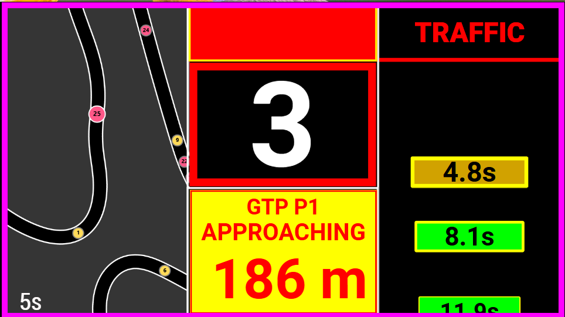

# Rejoin Assist

This page covers the driver-facing rejoin support in Lala Race Assist Plugin.

For a full post-install SimHub walkthrough of the plugin tabs and setup flow, see: [YouTube walkthrough (~30 min)](https://youtu.be/Ug9BRo0WRbE).

## 1. What Rejoin Assist is for

Rejoin Assist helps the driver make better decisions when the car is recovering from a spin, incident, off-track moment, or other compromised situation.

It is there to improve awareness, not to replace driver judgment.

## 2. What the driver may see

Typical support includes:

- warnings that traffic is approaching,
- recovery/rejoin context after a spin or serious incident,
- pit-exit or merge-related awareness where applicable,
- dashboard messaging or overlays that tell you the situation is still active.

## 3. What to trust

Trust Rejoin Assist most when:

- the current profile thresholds suit the car,
- the session state is normal,
- you use it as decision support rather than as an absolute command.

The intended outcome is simple: the plugin helps you avoid rushing back into traffic blindly.

## 4. When to cancel or override

Use **Cancel Message** when you need the alert out of the way for the current moment. That is the right choice when:

- the message is distracting,
- the situation has already changed,
- you understand the context and need the screen clear.

## 5. If Rejoin Assist feels repeatedly wrong

If rejoin behavior is repeatedly wrong, the likely issue is not the dashboard art. Review:

- saved profile thresholds,
- rejoin linger settings,
- clear-speed threshold,
- spin sensitivity or related profile tuning.

## 6. Practical mindset

Use Rejoin Assist as a calm decision-support layer:

- trust it more once your profile values are good,
- override it when the situation obviously demands it,
- review the saved thresholds if the same mistake keeps repeating.
