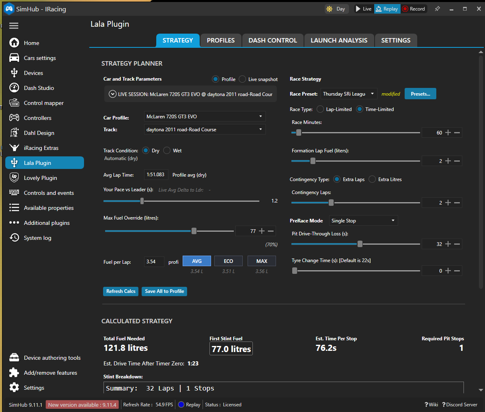

# Strategy System

This page explains the user-facing Strategy workflow in Lala Race Assist Plugin.

For a full post-install SimHub walkthrough of the plugin tabs and setup flow, see: [YouTube walkthrough (~30 min)](https://youtu.be/Ug9BRo0WRbE).

## 1. What Strategy is

**Strategy** is the main planning tab and the single user-facing entry point for race planning.

It brings together:

- saved profile and track data,
- live session snapshot data,
- deterministic planner outputs,
- preset management,
- PreRace display support.

User-facing docs should treat this as **Strategy**. Older “Fuel Planner” wording belongs to technical/internal documentation only.

## 2. Strategy vs live observation

The plugin keeps a deliberate split between:

- the **live fuel and pace systems**, which observe the current session and build confidence, and
- the **Strategy planner**, which creates a stable race plan from selected inputs.

That split is intentional. Stable planning should not drift every lap just because live conditions are still settling.

## 3. Planning sources

### Profile/manual planning

Use this when you want a stable plan built from:

- saved track values,
- saved profile values,
- manually chosen planning inputs.

This is the right choice when predictability matters most.

### Live Snapshot

Use this when you want Strategy to follow the current session snapshot.

When valid live values exist, the matching manual controls are disabled. That keeps the source of the plan clear instead of blending manual and live ownership.

## 4. What Live Snapshot means in practice

Live Snapshot is about **using the session as the source** for the relevant planning values. That can include:

- live lap-time context,
- live fuel-per-lap context,
- live confidence,
- live tank-cap information,
- live pace-versus-leader behavior when available.

Important rule:

> Live Snapshot helps you adapt to the session, but it does not erase the difference between observing the session and committing to a stable plan.

## 5. Why confidence matters

The plugin does not blindly trust every lap. Confidence exists because:

- pit laps are different,
- incident laps can poison the data,
- early laps are often noisy,
- wet and dry conditions need separate treatment.

Until confidence builds, saved profile values may still be the safer planning basis. For the fuel-learning side of that story, see [Fuel Model](Fuel_Model.md).

## 6. Presets

Presets are part of the Strategy workflow.

### Current preset flow

- Choose a race preset from Strategy.
- Open **`Presets...`** to create, rename, edit, save, or delete presets.
- Return to Strategy to apply and use them.
- The Preset Manager popup now uses the same working ComboBox behavior as the main Strategy page, keeping the selected value readable against the dark theme without breaking dropdown selection.

There is no separate top-level Presets tab.

### What presets are good for

Use presets for repeatable race assumptions such as:

- laps vs timed race format,
- contingency,
- tyre-change time,
- max-fuel assumption,
- preferred PreRace mode.

## 7. Track-scoped planning values

Some planning values belong to the current track/layout record rather than the whole car profile.

That helps prevent carrying the wrong assumptions between venues. Examples include:

- wet multiplier,
- pace delta to leader,
- fuel contingency settings.

## 8. PreRace

PreRace belongs under the Strategy story because it helps the driver understand the planned situation before the start.

Its role is intentionally limited:

- it is **display-oriented**,
- it is for **on-grid/pre-start guidance**,
- it does **not** replace Strategy calculations,
- it does **not** change the live fuel model.

PreRace status contract (dash-facing):
- `StatusText` now reports explicit outcomes (`NO STOP OKAY`, `SINGLE STOP OKAY`, `MAX FUEL REQUIRED`, `STRATEGY MISMATCH`, etc.).
- `StatusColour` publishes `green` / `orange` / `red` so dashboards can style the state without re-implementing logic.
- In `Auto`, PreRace first classifies the required strategy from stints (`<=1.0 no-stop`, `<=2.0 one-stop`, `>2.0 multi-stop`) and then evaluates status as that required strategy; Auto does not inherit manual mismatch warnings.
- In non-Auto modes, planner/live combo or race-definition mismatches are shown as an **orange caution** (`STRATEGY MISMATCH`) only when planner/live inputs are comparable; transient unknown values do not trigger mismatch.
- `FuelDelta` is now live for grid workflow:
  - required one-stop path uses `(current fuel + requested add) - total fuel needed`,
  - no-stop/multi-stop paths use `current fuel - total fuel needed`.
- One-stop feasibility now includes tank-space reality (`fuel still needed > max add possible` => red `ONE STOP NOT POSSIBLE`) before normal underfuel/overfuel checks.

## 9. What users should trust

Once the system has enough clean data, users should usually trust:

- the Strategy outputs,
- the stable fuel basis,
- the saved track data they have validated and locked,
- the profile data that has been learned and reviewed.

If Strategy looks repeatedly wrong, the usual causes are:

- poor live confidence,
- stale or bad saved track data,
- a profile value locked too early,
- a mismatch between live observation mode and stable planning intent.

## 10. Practical workflow

### Before the race

- Check the selected profile and track.
- Pick the right preset if you use presets.
- Decide whether you want Profile/manual planning or Live Snapshot.
- Confirm tank assumptions and contingency look sensible.
- Use PreRace for on-grid context only.

### During the race

- Let the plugin keep building live confidence.
- Avoid constant planner tweaking unless something is clearly wrong.
- Use the strategy displays as stable guidance, not as a reason to chase every lap.

### After the race

- Review anything that looked repeatedly wrong.
- Relearn only the affected saved values when needed.
- Keep good locks in place once validated.
