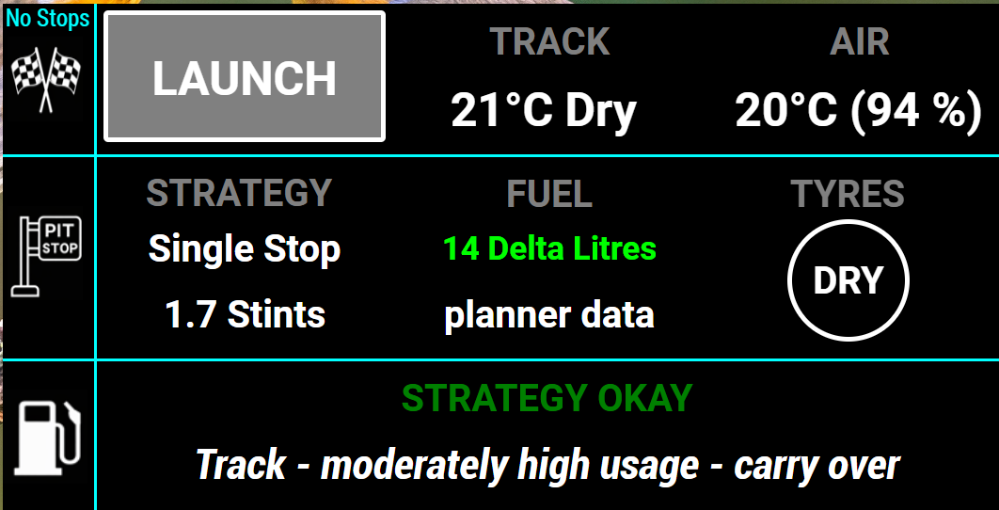
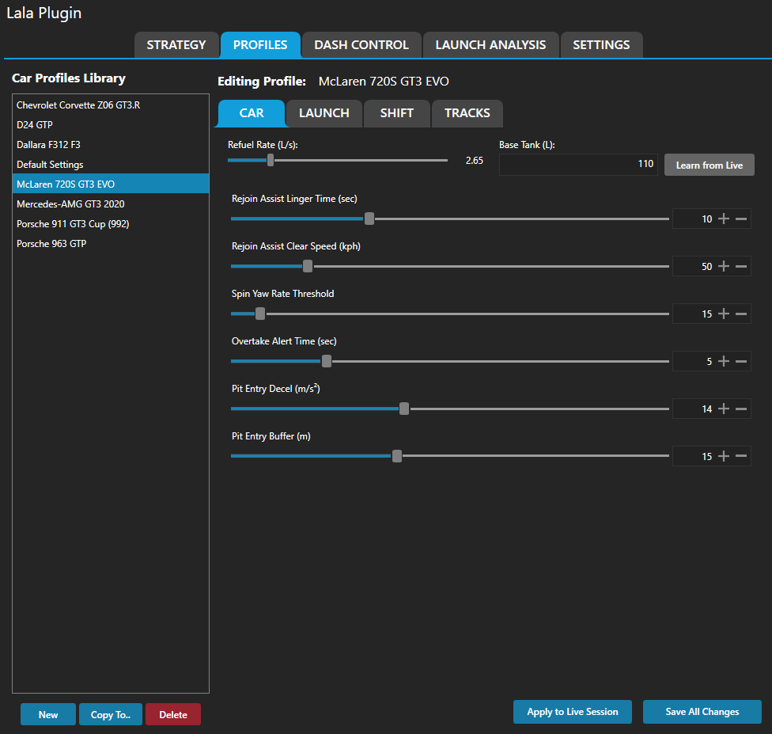
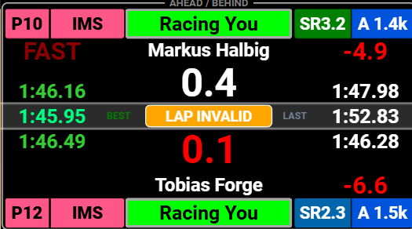
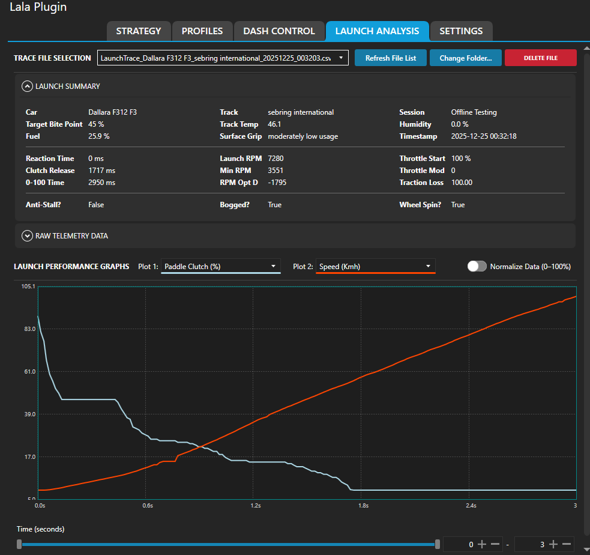

# User Guide

This guide is the central driver-facing overview for Lala Race Assist Plugin. It explains what the plugin owns, what the driver sees, and where to find the detailed user pages for each system.

## Video walkthrough (post-install)

If you want a full SimHub-side walkthrough of the plugin tabs and setup flow after installation, use this video first: [Lala Race Assist Plugin walkthrough (YouTube, ~30 min)](https://youtu.be/Ug9BRo0WRbE).

This video is intentionally post-install guidance and does not replace [Quick Start](Quick_Start.md) for initial installation/setup.

## 1. How to read the docs

Use this page as the overview, then jump to the dedicated pages for the systems you actively use:

- [Quick Start](Quick_Start.md)
- [Dashboards](Dashboards.md)
- [Strategy System](Strategy_System.md)
- [Shift Assist](Shift_Assist.md)
- [Launch System](Launch_System.md)
- [Rejoin Assist](Rejoin_Assist.md)
- [Pit Assist](Pit_Assist.md)
- [H2H System](H2H_System.md)
- [Profiles System](Profiles_System.md)
- [Fuel Model](Fuel_Model.md)

## 2. Plugin vs dashboard responsibility

### Plugin

The plugin:

- learns data,
- stores data,
- protects data,
- performs calculations,
- publishes outputs for dashboards.

### Dashboards

Dashboards:

- display those outputs,
- provide situational awareness,
- provide limited interaction through bindings or touch areas.

Dashboards do **not** become the source of truth for strategy, fuel math, H2H selection, saved learning, or persistence.

## 3. Current plugin navigation

The current top-level plugin order is:

1. **Overview**
2. **Strategy**
3. **Profiles**
4. **Dash Control**
5. **Launch Analysis**
6. **Settings**

Important workflow rules:

- **Overview** is the landing tab for quick orientation, links, and update status.
- The main planning tab is **Strategy**, not Fuel.
- There is **no separate Presets tab**.
- Presets are managed from **Strategy** using the **`Presets...`** modal flow.
- Launch controls belong under **Settings → Launch Settings**.
- **Launch Analysis** remains the separate post-run review tab.

## 4. Current constraints (v1.x)

- Some dashboard indicators depend on optional SimHub-side setup or optional exports.
- Wheelspin / traction-loss visuals depend on optional ShakeIt Motors export setup (`TractionLoss` property).
- Primary Dash navigation behavior may evolve as dashboard workflows are refined.
- In plugin UI, **Primary Dash Mode** binding is currently a placeholder and does not perform an action.
- Legacy `RSC.iRacingExtraProperties.dll` fallback paths are removed from active runtime code.

## 5. The main user-facing systems

### Strategy

Strategy is the main planning workflow. It lets you choose between stable profile/manual planning and live-driven snapshot planning without confusing those two jobs. See [Strategy System](Strategy_System.md).

*Use Strategy as the main planning surface; the dashboard view mirrors that workflow rather than replacing it.*

### Profiles

Profiles are the plugin’s long-term memory for car, track, and condition-specific data. They are what make the other systems become trustworthy over time. See [Profiles System](Profiles_System.md).

*Profiles are where you review and lock the saved values that should become trustworthy for a combo.*

### Fuel model

The fuel model learns gradually, builds confidence, and feeds Strategy with a trustworthy burn basis. See [Fuel Model](Fuel_Model.md).

### Dashboards

Dashboards are the display layer. They show outputs, visibility states, and context, but they do not own the calculations underneath. The expanded dashboard guide now documents the confirmed Primary Driver Dash page order, navigation model, overlays, and shared widget surfaces in one place. See [Dashboards](Dashboards.md).

*The Primary Driver Dash keeps immediate track-awareness readable while the plugin continues to own the underlying calculations and stable outputs.*

#### Friends list and driver tags

If you use the Friends list, manage it in **Settings → Friends List**. Add iRacing customer IDs there and assign the practical tag you want to use, such as **Friend**, **Teammate**, or **Bad**.

Those tags are mainly for **awareness and presentation** on supported nearby-car / CarSA-style surfaces. They help known drivers stand out more clearly on dashboards, but they do **not** change strategy math, fuel calculations, or the core H2H comparisons.

#### Dashboard navigation and bindings

The dashboard package is designed around SimHub's **Next Dash** and **Previous Dash** navigation model, with matching left/right touch areas on the Primary Driver Dash. Those bindings can be set up per dash, per device, or globally in SimHub, depending on your hardware and workflow.

Practical expectations for the current Primary Dash package:

- **Track Situational Awareness** and **Racing Standings Awareness** are the main race-facing pages.
- **Timing** is the qualifying-oriented timing surface.
- **Practice** can be selected manually in practice sessions.
- pit and alert surfaces remain separate from the core page loop when they are acting as temporary overlays.

For the detailed page-by-page breakdown, use the main [Dashboards](Dashboards.md) guide rather than treating this overview page as the full dashboard manual.

#### Optional: ShakeIt Motors traction-loss export

Some Lala dashboards and launch/practice visuals can use SimHub's ShakeIt Motors output for wheelspin / traction-loss indications. This is **optional** and is not a core plugin requirement. If you do nothing here, the plugin still works normally.

Set it up only if you want those specific indicators:

1. Open **SimHub** and go to **ShakeIt Motors**.
2. Open the **Wheel slip** effect and enable it.
3. In the effect's **Export** section, tick **Export output value as a property**.
4. Set the property name to exactly `TractionLoss`.

This exposes `[ShakeITMotorsV3Plugin.Export.TractionLoss.All]`. Dashboards or visuals that read that property can then show wheelspin / traction-loss activity. Without this setup, those indicators may be unavailable while the rest of the plugin continues to operate normally.

### Shift Assist

Shift Assist gives RPM-based driver cues and becomes more trustworthy once its learned values are stable and locked. See [Shift Assist](Shift_Assist.md).

### Launch

Launch setup is handled in Settings, while Launch Analysis is used afterwards to review saved starts. See [Launch System](Launch_System.md).

*Launch Analysis is the active review surface for saved launches after the run, not a future or placeholder feature.*

### Rejoin and pit aids

Lala Race Assist Plugin includes separate driver-facing pages for recovery/rejoin support and pit-lane support:

- [Rejoin Assist](Rejoin_Assist.md)
- [Pit Assist](Pit_Assist.md)

### H2H

H2H is a read-only race-context aid that helps the driver compare race-order and local-track threats without becoming a separate planning workflow. See [H2H System](H2H_System.md).

## 6. Trust model

A good mental model for the whole plugin is:

**learn → validate → lock → trust**

Use that pattern for:

- profile values,
- fuel burn and pace baselines,
- pit-loss and marker data,
- Shift Assist targets,
- launch defaults,
- assist thresholds that repeatedly affect what you see while driving.

Pit-loss baseline rule: learn pit-lane loss using a clean **drive-through** (limiter speed, no box stop), then lock when validated.

If a system is wrong once, keep driving. If it is wrong repeatedly, review the saved data or thresholds behind it instead of assuming the dashboard art is the problem.

## 7. Practical best practice

- Start each new car/track combination by gathering clean laps.
- Use **Strategy** as the single planning entry point.
- Keep the difference between **live observation** and **stable planning** clear in your workflow.
- Lock only values that have settled and make sense.
- Use **Dash Control** for visibility and presentation, not to fix calculation logic.
- Treat touch navigation as a backup or convenience layer; for race use, bind **Next Dash** and **Previous Dash** to physical controls.
- Review profile-backed data when a driver aid is repeatedly wrong.

## 8. Recommended reading order

For most drivers, this order works well:

1. [Quick Start](Quick_Start.md)
2. [Strategy System](Strategy_System.md)
3. [Profiles System](Profiles_System.md)
4. [Fuel Model](Fuel_Model.md)
5. [Dashboards](Dashboards.md)
6. Then the feature pages you use most: [Shift Assist](Shift_Assist.md), [Launch System](Launch_System.md), [Rejoin Assist](Rejoin_Assist.md), [Pit Assist](Pit_Assist.md), and [H2H System](H2H_System.md)
