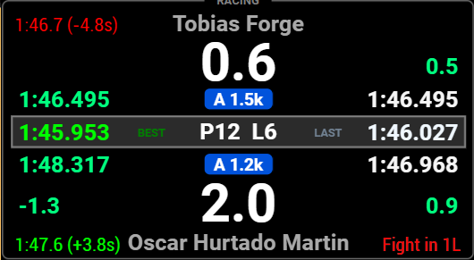

# Lala Race Assist Plugin

Lala Race Assist Plugin is a SimHub plugin for **iRacing** focused on race engineering, driver support, and dashboard-ready outputs. It combines planning, learned data, and live race context so drivers can make cleaner decisions without pushing core logic into dashboards.

It is built to help with the practical race workflow: plan stints, trust learned fuel and pace data, manage launch and pit situations, and keep key race context visible while driving.

Version **1.0** documentation is now organized so GitHub readers can move from a quick user overview into the canonical subsystem docs without guessing which page owns which truth.

## At a glance

*Strategy is the main plugin home for planning, live snapshot inputs, and preset-driven race setup.*

*The strategy dashboard focuses on fuel, stint, and race-context decisions without moving that logic out of the plugin.*

*The driver-facing dash keeps nearby race context visible while you stay focused on driving.*

*Pit entry guidance is presented on the dash, while the plugin continues to own the underlying timing and marker logic.*

*Launch Analysis remains the active post-run review surface for saved starts and launch traces.*

## Core Systems

- **Strategy** - stable planning workflow for race fuel, stint, and context decisions
- **Shift Assist** - RPM-based shift cueing with profile-backed trust and locking workflows
- **Launch System** - launch setup plus saved-run review through Launch Analysis
- **Rejoin Assist** - recovery and rejoin awareness support after incidents or off-tracks
- **Pit Assist** - pit-entry and pit-lane support surfaced through the plugin and dashboards
- **H2H** - same-class race and local-track comparison context
- **Profiles** - long-term saved data by car, track, and condition
- **Fuel Model** - learned fuel burn and confidence that feed the planning workflow
- **Dashboards** - dashboard integration for display, visibility, and interaction with plugin outputs

## Supported Scope

- **Platform:** SimHub
- **Sim:** iRacing only
- **Primary use:** race planning, learned-data workflows, driver aids, and dashboard-supported race context

## Plugin vs Dashboard Responsibility

The plugin owns the **learning, storage, calculations, and exports**. Dashboards are the presentation layer: they show those outputs and provide limited interaction, but they do not own strategy math, saved learning, H2H selection, or launch logic.

## Dashboard Package

The dashboard docs now include a dedicated Primary Driver Dash guide covering the confirmed page order, navigation model, pit pop-up, LalaAlerts overlay layer, and shared widget surfaces. If you are importing dashboards or binding page controls, start with [Docs/Dashboards.md](Docs/Dashboards.md).

## Install Summary

1. Copy the 2 plugin *.dll files into your SimHub root installation.
2. Keep **`RSC.iRacingExtraProperties.dll` required for now**.
3. Restart SimHub.
4. Import the dashboards you want to use.
5. Open the plugin and begin with **Strategy**, then review **Profiles**, **Dash Control**, and **Settings**.
6. For more detailed instructions and help refer to the main user guide or quick start guide in links below.

## Current Constraints (v1.x)

- Some dashboard behaviors depend on optional SimHub-side setup and optional dashboard exports. If those are not configured, affected indicators or overlays may be missing while core plugin systems still work.
- Wheelspin / traction-loss indicators depend on optional **ShakeIt Motors** export setup (`TractionLoss` property). Without that optional export, those indicators are unavailable.
- Primary Dash navigation behavior is still evolving as the dashboard package is refined for early testers.
- In plugin UI, **Primary Dash Mode** binding is currently a future placeholder and does not perform an action yet.
- **`RSC.iRacingExtraProperties.dll` remains required** in this release line.

## Support and Feedback

If you run into problems or want to suggest improvements, please use the GitHub support tools so issues can be tracked properly.

### Bug Reports

If something is not working as expected, open a **Bug Report**:

**Issues → New Issue → Bug Report**

Please include:

- plugin version
- SimHub version
- screenshots or logs if possible

This helps reproduce and resolve the problem faster.

### Feature Requests

If you have ideas for improving the plugin or workflow:

**Issues → New Issue → Feature Request**

### Questions or Setup Help

For general help, setup questions, or discussion about dashboards or workflows, please use **GitHub Discussions**.

Discussions are the best place for:

- dashboard setup questions
- usage advice
- race workflow discussions
- general feedback

### Dashboard Issues

If you encounter a problem specifically with a dashboard layout or behaviour, open a **Dashboard Issue**.

---

Using Issues and Discussions helps keep the documentation, plugin behaviour, and user feedback aligned.

## Documentation

### Getting Started

- [Quick Start](Docs/Quick_Start.md)
- [User Guide](Docs/User_Guide.md)

### Driver Systems

- [Strategy System](Docs/Strategy_System.md)
- [Shift Assist](Docs/Shift_Assist.md)
- [Launch System](Docs/Launch_System.md)
- [Rejoin Assist](Docs/Rejoin_Assist.md)
- [Pit Assist](Docs/Pit_Assist.md)
- [H2H System](Docs/H2H_System.md)
- [Profiles System](Docs/Profiles_System.md)
- [Fuel Model](Docs/Fuel_Model.md)

### Technical / Canonical Subsystems

- [Project Index](Docs/Project_Index.md) - documentation map and ownership guide
- [Subsystem docs](Docs/Subsystems/) - canonical subsystem behavior, boundaries, and export-level contracts
- [Dash integration notes](Docs/Subsystems/Dash_Integration.md)
- [Changelog](CHANGELOG.md)

## Current UI Structure

The current top-level plugin navigation is:

1. **Strategy**
2. **Profiles**
3. **Dash Control**
4. **Launch Analysis**
5. **Settings**

Presets are managed from **Strategy** through the **`Presets...`** modal flow. There is no separate top-level Presets tab.

## Notes / Important Boundaries

- **PreRace** is display-only. It does not replace the planner or change the live fuel model.
- **Live Snapshot** can auto-drive relevant planning values. When it is active, the corresponding manual controls are disabled.
- Launch controls live under **Settings -> Launch Settings**. **Launch Analysis** remains the saved-run review tab.
- The future/global message system is not documented here as an active user feature.

## License

Lala Race Assist Plugin  
Copyright © 2026 Lalabot77

This project is released under the MIT License.  
See the LICENSE file for details.
